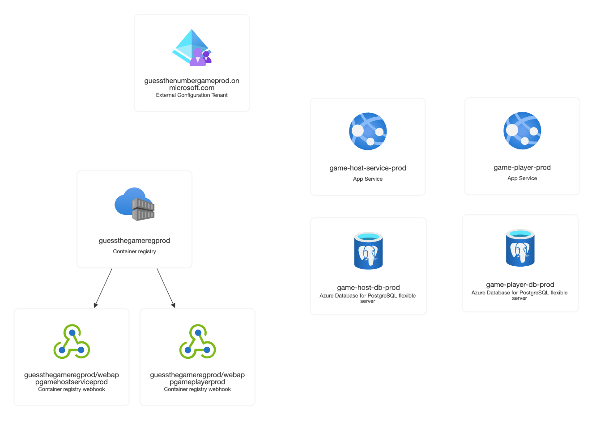

# Guess the Number Web Services

A containerized "Guess the Number" game application with two web services deployed on Azure App Service.

## Project Overview

This project implements a "Guess the Number" game with two services:
- **Game Host**: Authenticated REST API service that manages game logic
- **Player**: Frontend service with bot algorithms that interacts with the game host

### How It Works
1. Player service initiates a game through the host's API
2. Game host assigns a unique ID and random number (1-10,000)
3. Player makes guesses and receives feedback (higher/lower/correct)
4. Game ends when the number is successfully guessed

## Documentation

- **[Architecture Overview](ARCHITECTURE.md)** - System architecture and deployment details
- **[Self Assessment](SELF_ASSESSMENT.md)** - Project evaluation and self-rating

## Technology Stack

- **Frontend**: Next.js 16, React 19, TypeScript, Tailwind CSS
- **Backend**: Fastify, TypeScript, PostgreSQL, Drizzle ORM
- **Deployment**: Azure App Service, Azure Container Registry
- **Authentication**: Azure AD, Microsoft as auth provider